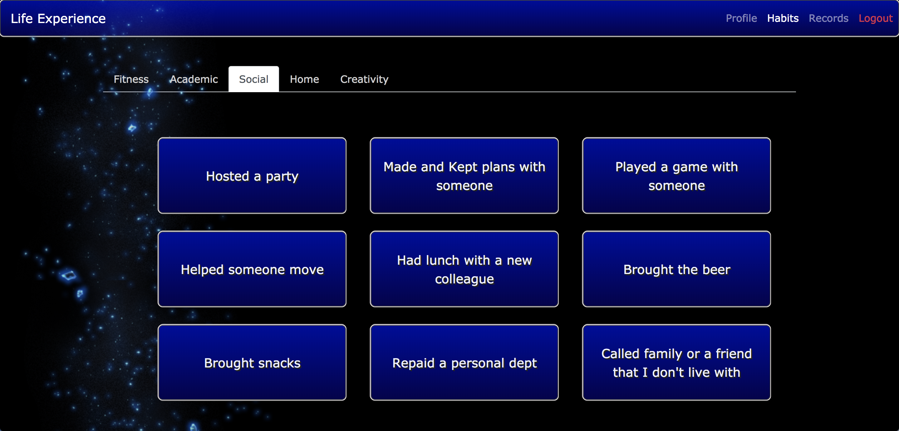
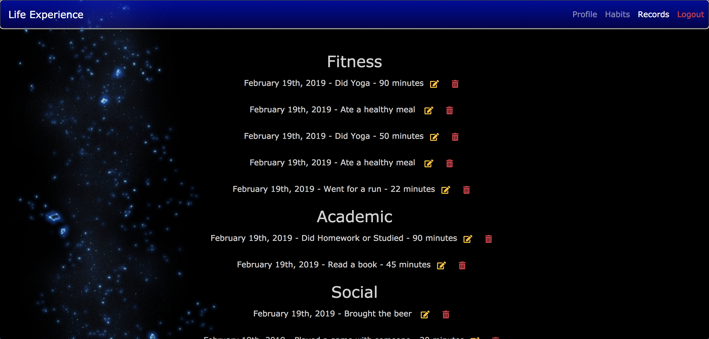

# Life Experience

  This is my front-end capstone at Nashville Software School.  My time management skills are not so great.  Finding motivation to take care of myself in pretty basic ways can be difficult sometimes.  I wanted to make an app that would reward people for putting a little more effort into improving their daily habits.  Using experience points to gain levels is something that already speaks to me as a gamer.  My hope is that this app will give people (mostly me) a visual indication of immediate progress to help turn their goals into healthy life habits.  

  Once a user logs in, a profile is set up for them using their google profile picture and display name.  First time users will start at level 1 with 0 experience points in five different categories.  Each category has a list of 9 healthy habits for the user to choose from to gain experience points in that category.  Once enough experience is gained in any category, the user's profile will level up.  Progress is displayed on the profile page in the form of 5 progress bars, as well as on the recodrds page where completed habits can be edited or deleted.  
  
### Technologies Used

- Javascript
- Html and css
- Github
- Firebase
- Bootstrap
- Reactstrap
- React

### Deploy and Github Links

<p><a href="https://life-experience-672c6.firebaseapp.com">https://life-experience-672c6.firebaseapp.com</a></p>
<p><a href="https://github.com/TimothyHarley/life-experience">https://github.com/TimothyHarley/life-experience</a></p>

### Screenshots






### Run this project

- Create a Firebase Project
- Enable 'Google Authentication'
- Create a Firebase Realtime Database
- Create an apiKeys.js file (see apiKeys.js.example)
- Clone or download the repo
- Browse to the repo directory in your terminal
- Type ```npm install``` in terminal to install necessary dependencies
- Type ```npm start``` to run project at http://localhost:3000

### Credits
This app was written by Timothy Harley(that's me!) with help from these kind people:
- Zoe Ames
- Callen Morrison
- Adam Wieckert
- <a href="https://codepen.io/Reignson/">Reignson</a>
- <a href="https://codepen.io/terrancerobb/">Terrance Rob</a>
- And a special thanks to Lauren Rouse, who ordered me to ask for help if I ever get stuck for more than 15 minutes.

#### Thank you all!
